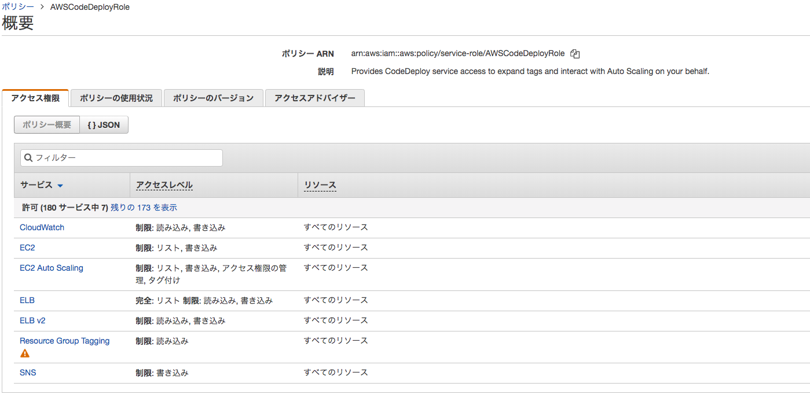

# AWS CodeDeploy

## ロールとCodeDeploy
https://milestone-of-se.nesuke.com/sv-advanced/aws/iam-policy-role-group/
* AWSではrootアカウントでログインしている状態だが、サービスを利用するときはロールを付与して最低限の権限で運用する
* IAMはAWSの権限を一元管理するサービス

### 基本操作
* 右上メニュー > マイセキュリティ資格情報 > ロール
    * ロールの作成でロールを作成する
* CodeDeployがEC2にアクセスできるようなロールを作成
    * AWSサービス > CodeDeploy > CodeDeploy
    * AWSCodeDeployRoleという「ポリシー」が選択されていることを確認し、次へ
        * このポリシーを使ってロールをこの後作成する
        * ロール名をクリックするとポリシー詳細が確認できる
        * 
    * ロールの作成(タグ付け)
        * 作成するロールにタグを付ける
        * 空で良い
    * ロールの作成(確認)
        * ロール名：CodeDeployExampleRole
    * 作成が完了するとロール一覧に表示される

## 必要なロール作成
https://qiita.com/terukizm/items/e2c1400d129042868731

下記ロールを作成する。

* CodeDeploy -> EC2 へのアクセス用ロール(CodeDeployExampleRole)
* EC2 -> S3 へのReadOnlyアクセス用ロール(EC2ExampleRole)
    * ポリシーのフィルタで「AmazonS3ReadOnlyAccess」ポリシーを選択

## EC2インスタンスを作成する
以下を行う必要がある。
* EC2->S3アクセス用ロールをIAMロールとして設定
* インスタンスにタグを設定
* インスタンスに「CodeDeploy Agent」をインストールし、起動させる

以下で作成。
* t2.micro
* 手順3：インスタンスの詳細の設定
    * IAMロール：EC2ExampleRole
* 手順5: タグの追加
    * codedeploy:example
* 手順6: セキュリティグループの設定
    * セキュリティグループで「OfficeOnly」を選択しておく
* キーペア設定で予め配布されたpemを指定

## EC2インスタンスにログイン、各種設定
* sshログイン
    * `ssh -i ~/.ssh/aws-dev-tokyo.pem ec2-user@[ip or domain]`
* CodeDeploy Agentをインストールする
    * https://github.com/mapserver2007/aws-provisioning-recipes/tree/master/ec2-code-deploy-server

## CodeDeployアプリケーション追加
* サービス > CodeDeploy > アプリケーションの作成
* アプリケーションの設定
    * コンピューティングプラットフォーム: EC2/オンプレミス
* デプロイグループ
    * デプロイグループ名: code-deploy-example-group
    * サービスロール: CodeDeployExampleRole
    * デプロイタイプ: Blue/Green
        * インプレースはすでに稼働しているEC2インスタンスにデプロイする
        * Blue/Greenはデプロイ対象の EC2 インスタンスや AutoScaling グループを新規に用意して 古いインスタンスは破棄する
    * 環境設定: インスタンスの手動プロビジョン
        * Amazon EC2インスタンス
    * デプロイ設定:
        * すぐにトラフィックを再ルーティング
        * デプロイグループの置き換え元インスタンスを終了
        * デプロイ設定:
            * https://docs.aws.amazon.com/ja_jp/codedeploy/latest/userguide/deployment-configurations.html
            * CodeDeployDefault.AllAtOnce
                * 1つでも失敗すると全部失敗
    * ロードバランサ
        * Application Load BalancerまたはNetwork Load Balancer

## S3, Github連携
* S3設定が必要なのは、Githubからcloneしてきたソースコードをビルドし結果を置いておくため
* 