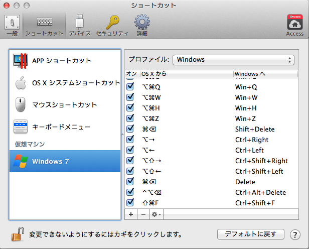
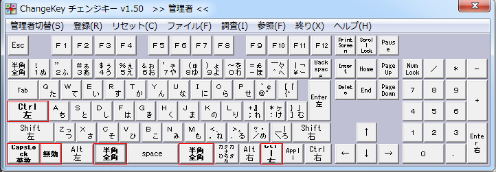

# Windows on Parallels Desktop
## MacのキーボードからWindowsを操作する
Parallels Desktopなどを使っていると、Macのキーボード配列からWindowsを操作することになり大変不便なので、キーボードのキーを入れ替える。

## Windows側にキーボード命令を送信する
特定のキー操作はWindows側で認識せず、ホストのMac側で認識してしまう。  
Windows側に伝えるには個別に設定してあげる必要がある。

1. Docの「Windows7」を右クリック
2. [デバイス]->[キーボード]->[カスタマイズ]を選択
3. [仮想マシン]でプロファイルを[Windows]にして「＋」をクリック
4. 選択前(Mac)、選択後(Win)を設定して追加する

以下、設定する必要のある項目一覧。

### キー入れ替えソフトをインストール
[Change Key](http://www.forest.impress.co.jp/library/software/changekey/)をインストールする。  

### 入れ替え内容

| 変更前キー(Mac/Windows) | 変更後キー(Windows) |
|-------------------------|---------------------|
| 右Command/右Win         | 右Ctrl              |
| Control/CapsLock        | 左Ctrl              |
| Caps/左Ctrl             | CapsLock            |
| かな/前変換             | 半角全角            |
| 英数/無変換             | 半角全角            |

## VisualStudio設定
[こちら](https://github.com/mapserver2007/documents/blob/master/visualstudio/settings.md)を参照のこと。
